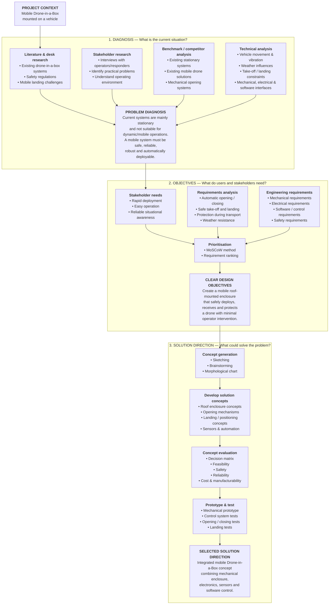

```mermaid
flowchart TD

    A["`**PROJECT CONTEXT**
    Mobile Drone-in-a-Box
    mounted on a vehicle`"]

    subgraph P1["1. DIAGNOSIS — What is the current situation?"]
        B1["`**Literature & desk research**
        • Existing drone-in-a-box systems
        • Safety regulations
        • Mobile landing challenges`"]

        B2["`**Stakeholder research**
        • Interviews with operators/responders
        • Identify practical problems
        • Understand operating environment`"]

        B3["`**Benchmark / competitor analysis**
        • Existing stationary systems
        • Existing mobile drone solutions
        • Mechanical opening systems`"]

        B4["`**Technical analysis**
        • Vehicle movement & vibration
        • Weather influences
        • Take-off / landing constraints
        • Mechanical, electrical & software interfaces`"]

        B5["`**PROBLEM DIAGNOSIS**
        Current systems are mainly stationary
        and not suitable for dynamic/mobile operations.
        A mobile system must be safe, reliable,
        robust and automatically deployable.`"]

        B1 --> B5
        B2 --> B5
        B3 --> B5
        B4 --> B5
    end

    subgraph P2["2. OBJECTIVES — What do users and stakeholders need?"]
        C1["`**Stakeholder needs**
        • Rapid deployment
        • Easy operation
        • Reliable situational awareness`"]

        C2["`**Requirements analysis**
        • Automatic opening / closing
        • Safe take-off and landing
        • Protection during transport
        • Weather resistance`"]

        C3["`**Engineering requirements**
        • Mechanical requirements
        • Electrical requirements
        • Software / control requirements
        • Safety requirements`"]

        C4["`**Prioritisation**
        • MoSCoW method
        • Requirement ranking`"]

        C5["`**CLEAR DESIGN OBJECTIVES**
        Create a mobile roof-mounted enclosure
        that safely deploys, receives and protects
        a drone with minimal operator intervention.`"]

        C1 --> C4
        C2 --> C4
        C3 --> C4
        C4 --> C5
    end

    subgraph P3["3. SOLUTION DIRECTION — What could solve the problem?"]
        D1["`**Concept generation**
        • Sketching
        • Brainstorming
        • Morphological chart`"]

        D2["`**Develop solution concepts**
        • Roof enclosure concepts
        • Opening mechanisms
        • Landing / positioning concepts
        • Sensors & automation`"]

        D3["`**Concept evaluation**
        • Decision matrix
        • Feasibility
        • Safety
        • Reliability
        • Cost & manufacturability`"]

        D4["`**Prototype & test**
        • Mechanical prototype
        • Control system tests
        • Opening / closing tests
        • Landing tests`"]

        D5["`**SELECTED SOLUTION DIRECTION**
        Integrated mobile Drone-in-a-Box concept
        combining mechanical enclosure,
        electronics, sensors and software control.`"]

        D1 --> D2
        D2 --> D3
        D3 --> D4
        D4 --> D5
    end

    A --> B1
    B5 --> C1
    C5 --> D1
```
