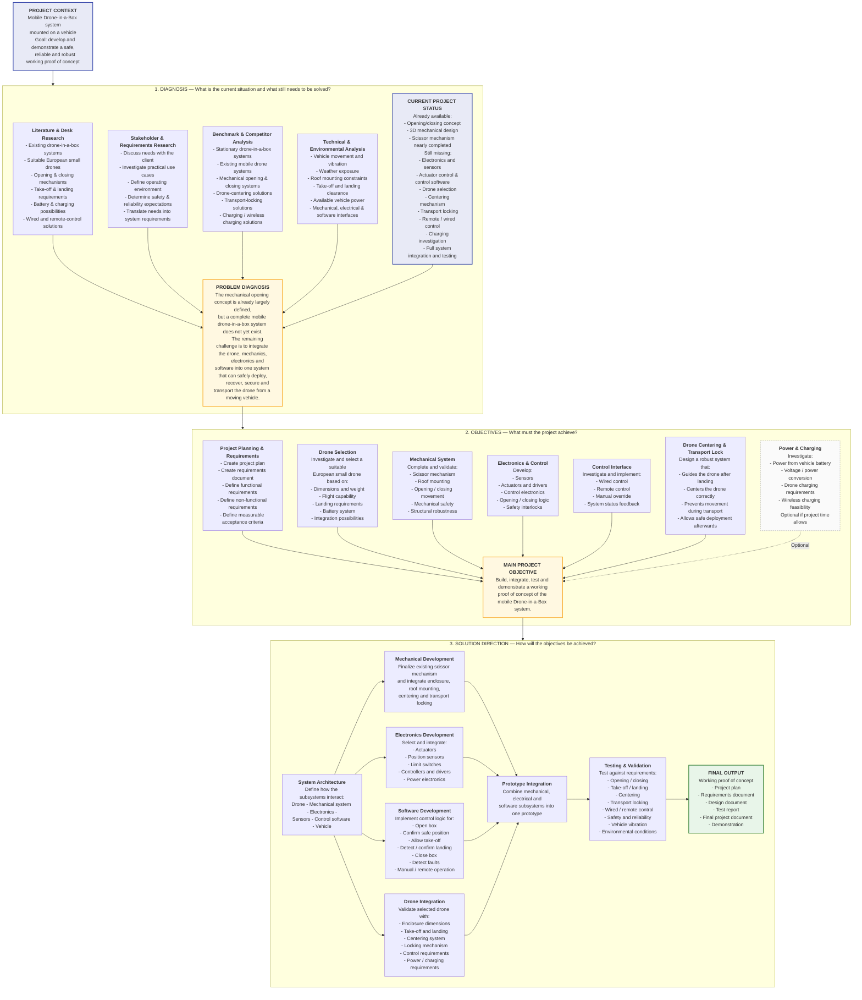

# Mobile Drone-in-a-Box — Visual Representation

```mermaid
flowchart TD

    A["`**PROJECT CONTEXT**
    Mobile Drone-in-a-Box system
    mounted on a vehicle

    Goal: develop and demonstrate a safe,
    reliable and robust working proof of concept`"]

    %% =====================================================
    %% PHASE 1 - DIAGNOSIS
    %% =====================================================
    subgraph P1["1. DIAGNOSIS — What is the current situation and what still needs to be solved?"]

        B1["`**Literature & Desk Research**
        - Existing drone-in-a-box systems
        - Suitable European small drones
        - Opening & closing mechanisms
        - Take-off & landing requirements
        - Battery & charging possibilities
        - Wired and remote-control solutions`"]

        B2["`**Stakeholder & Requirements Research**
        - Discuss needs with the client
        - Investigate practical use cases
        - Define operating environment
        - Determine safety & reliability expectations
        - Translate needs into system requirements`"]

        B3["`**Benchmark & Competitor Analysis**
        - Stationary drone-in-a-box systems
        - Existing mobile drone systems
        - Mechanical opening & closing systems
        - Drone-centering solutions
        - Transport-locking solutions
        - Charging / wireless charging solutions`"]

        B4["`**Technical & Environmental Analysis**
        - Vehicle movement and vibration
        - Weather exposure
        - Roof mounting constraints
        - Take-off and landing clearance
        - Available vehicle power
        - Mechanical, electrical & software interfaces`"]

        B5["`**CURRENT PROJECT STATUS**
        Already available:
        - Opening/closing concept
        - 3D mechanical design
        - Scissor mechanism nearly completed

        Still missing:
        - Electronics and sensors
        - Actuator control & control software
        - Drone selection
        - Centering mechanism
        - Transport locking
        - Remote / wired control
        - Charging investigation
        - Full system integration and testing`"]

        B6["`**PROBLEM DIAGNOSIS**
        The mechanical opening concept is already largely defined,
        but a complete mobile drone-in-a-box system does not yet exist.

        The remaining challenge is to integrate the drone, mechanics,
        electronics and software into one system that can safely deploy,
        recover, secure and transport the drone from a moving vehicle.`"]

        B1 --> B6
        B2 --> B6
        B3 --> B6
        B4 --> B6
        B5 --> B6
    end

    %% =====================================================
    %% PHASE 2 - OBJECTIVES
    %% =====================================================
    subgraph P2["2. OBJECTIVES — What must the project achieve?"]

        C1["`**Project Planning & Requirements**
        - Create project plan
        - Create requirements document
        - Define functional requirements
        - Define non-functional requirements
        - Define measurable acceptance criteria`"]

        C2["`**Drone Selection**
        Investigate and select a suitable
        European small drone based on:
        - Dimensions and weight
        - Flight capability
        - Landing requirements
        - Battery system
        - Integration possibilities`"]

        C3["`**Mechanical System**
        Complete and validate:
        - Scissor mechanism
        - Roof mounting
        - Opening / closing movement
        - Mechanical safety
        - Structural robustness`"]

        C4["`**Electronics & Control**
        Develop:
        - Sensors
        - Actuators and drivers
        - Control electronics
        - Opening / closing logic
        - Safety interlocks`"]

        C5["`**Control Interface**
        Investigate and implement:
        - Wired control
        - Remote control
        - Manual override
        - System status feedback`"]

        C6["`**Drone Centering & Transport Lock**
        Design a robust system that:
        - Guides the drone after landing
        - Centers the drone correctly
        - Prevents movement during transport
        - Allows safe deployment afterwards`"]

        C7["`**Power & Charging**
        Investigate:
        - Power from vehicle battery
        - Voltage / power conversion
        - Drone charging requirements
        - Wireless charging feasibility

        Optional if project time allows`"]

        C8["`**MAIN PROJECT OBJECTIVE**
        Build, integrate, test and demonstrate a working
        proof of concept of the mobile Drone-in-a-Box system.`"]

        C1 --> C8
        C2 --> C8
        C3 --> C8
        C4 --> C8
        C5 --> C8
        C6 --> C8
        C7 -. Optional .-> C8
    end

    %% =====================================================
    %% PHASE 3 - SOLUTION DIRECTION
    %% =====================================================
    subgraph P3["3. SOLUTION DIRECTION — How will the objectives be achieved?"]

        D1["`**System Architecture**
        Define how the subsystems interact:
        Drone - Mechanical system - Electronics -
        Sensors - Control software - Vehicle`"]

        D2["`**Mechanical Development**
        Finalize existing scissor mechanism
        and integrate enclosure, roof mounting,
        centering and transport locking`"]

        D3["`**Electronics Development**
        Select and integrate:
        - Actuators
        - Position sensors
        - Limit switches
        - Controllers and drivers
        - Power electronics`"]

        D4["`**Software Development**
        Implement control logic for:
        - Open box
        - Confirm safe position
        - Allow take-off
        - Detect / confirm landing
        - Close box
        - Detect faults
        - Manual / remote operation`"]

        D5["`**Drone Integration**
        Validate selected drone with:
        - Enclosure dimensions
        - Take-off and landing
        - Centering system
        - Locking mechanism
        - Control requirements
        - Power / charging requirements`"]

        D6["`**Prototype Integration**
        Combine mechanical, electrical and
        software subsystems into one prototype`"]

        D7["`**Testing & Validation**
        Test against requirements:
        - Opening / closing
        - Take-off / landing
        - Centering
        - Transport locking
        - Wired / remote control
        - Safety and reliability
        - Vehicle vibration
        - Environmental conditions`"]

        D8["`**FINAL OUTPUT**
        Working proof of concept
        - Project plan
        - Requirements document
        - Design document
        - Test report
        - Final project document
        - Demonstration`"]

        D1 --> D2
        D1 --> D3
        D1 --> D4
        D1 --> D5

        D2 --> D6
        D3 --> D6
        D4 --> D6
        D5 --> D6

        D6 --> D7
        D7 --> D8
    end

    %% =====================================================
    %% MAIN PROJECT JOURNEY
    %% =====================================================
    A --> P1
    B6 --> P2
    C8 --> P3

    %% =====================================================
    %% STYLING
    %% =====================================================
    classDef context fill:#e8eaf6,stroke:#3949ab,stroke-width:2px
    classDef milestone fill:#fff8e1,stroke:#f9a825,stroke-width:2px
    classDef output fill:#e8f5e9,stroke:#2e7d32,stroke-width:2px
    classDef optional fill:#fafafa,stroke:#9e9e9e,stroke-dasharray:4 3

    class A context
    class B6,C8 milestone
    class B5 context
    class D8 output
    class C7 optional
```
